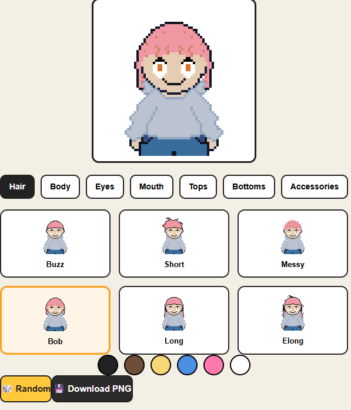

<div align="center">

# 🎨 pixel.me

Create your own pixel-art avatar directly in your browser.

**Live Demo**

🌐 https://pixel-me-one.vercel.app/



</div>

---

## ✨ Features

- 🎭 Multiple hairstyles
- 🎨 Hair color customization
- 👕 Tops & outfits
- 👖 Bottoms selection
- 😊 Eyes & mouth customization
- 🎀 Accessories
- 🎲 Random avatar generator
- 📥 Pixel-perfect PNG export
- 📱 Mobile-friendly design
- ⚡ Fast and responsive React application

---

## 🚀 Live Demo

Visit the project here:

### https://pixel-me-one.vercel.app/

---

## 📸 Preview


---

## 🛠️ Built With

- React
- JavaScript (ES6)
- Vite
- HTML5
- CSS3

---

## 📂 Project Structure

```text
src
├── assets
├── components
│   ├── Avatar
│   ├── CategoryTabs
│   ├── HairColors
│   ├── ItemGrid
│   ├── RandomButton
│   └── DownloadButton
├── data
├── utils
└── App.jsx
```

---

## 📦 Getting Started

Clone the repository

```bash
git clone https://github.com/SourikSasmal/pixel.me.git
```

Move into the project

```bash
cd pixel.me
```

Install dependencies

```bash
npm install
```

Run locally

```bash
npm run dev
```

---

## 🎯 Roadmap

Planned features for future versions:

- 💾 Save avatars
- 🔗 Shareable avatar links
- 👒 Hats and masks
- 🧥 More clothing options
- 💇 More hairstyles
- 🌙 Dark mode
- 🧑 Character presets
- ✨ Animations

---

## 👨‍💻 Author

**Sourik Sasmal**

GitHub:
https://github.com/SourikSasmal

---

## ⭐ Support

If you enjoyed this project, consider giving it a ⭐ on GitHub!

---

## 📄 License

This project is licensed under the MIT License.